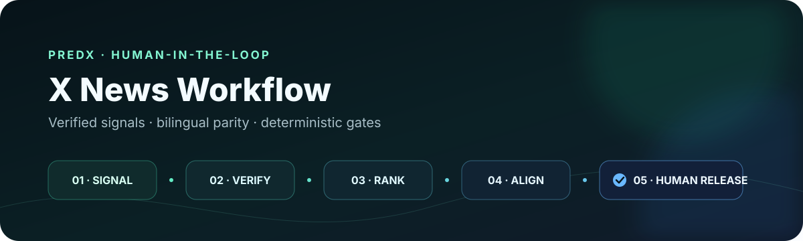
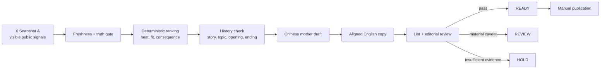

# PredX X News Workflow

[简体中文](README.zh-CN.md) · [Architecture](docs/ARCHITECTURE.md) · [Responsible use](docs/RESPONSIBLE_USE.md) · [Publication checklist](docs/PUBLICATION_CHECKLIST.md)

A human-in-the-loop editorial workflow for producing verified, bilingual X post packages. It combines X-first demand signals, source and freshness gates, account-aware story routing, Chinese-first drafting, English semantic alignment, history-aware deduplication, shared-run reliability controls, conservative performance feedback, and deterministic pre-publication linting.

This repository is a public showcase of the workflow—not an autonomous posting bot. It never logs into X, stores credentials, publishes posts, or performs engagement actions.

## Why this project exists

Fast social publishing usually optimizes for speed at the expense of provenance, consistency, or editorial control. This workflow treats those constraints as product requirements:

- **Demand before drafting:** a story must show visible, time-bounded X demand; popularity helps select a story but never proves it true.
- **Truth before reach:** primary sources and reputable reporting verify the event after the demand gate.
- **Bilingual parity:** Chinese is the locked mother draft; English preserves the same blocks, facts, numbers, attribution, uncertainty, and conclusion.
- **Account fit without fake independence:** four distribution lenses share one controlled PredX editorial system.
- **Human release control:** outputs can be `READY`, `REVIEW`, or `HOLD`; publication always stays with an editor.

## Workflow at a glance



The full decision model is documented in [Architecture](docs/ARCHITECTURE.md).

## What is included

| Component | Role |
|---|---|
| `.agents/skills/predx-x-news-writer/` | Installable Codex Skill with the full editorial contract |
| `references/` | Source, freshness, account, bilingual, style, scheduling, and verification rules |
| `rank_candidates.py` | Scores eligible stories and applies account/category priorities |
| `build_run_context.py` | Builds compact recent-history context for duplicate and style checks |
| `run_lock.py` | Provides one project-wide lease so scheduled and manual runs cannot race on shared history or browser state |
| `check_manual_cooldown.py` | Applies a bounded cooldown after an Alpha `HOLD`, with an explicit override path |
| `build_performance_feedback.py` | Turns read-only published-post metrics into soft, reversible same-account priors |
| `lint_output.py` | Validates structure, bilingual parity, safety rules, and history collisions |
| `examples/` | Synthetic input and output fixtures safe for public use |
| `tests/` and `scripts/test_*.py` | Dependency-free CLI and regression tests for ranking, lint, history, locks, cooldowns, and feedback |

Production run records, browser state, source archives, local dependencies, and credentials are intentionally excluded.

## Quick start

Requirements: Python 3.10+; the utility scripts use only the standard library.

The full workflow and script regression suite require a POSIX environment (Linux, macOS, or WSL): `run_lock.py` uses Python's `fcntl` module. Native Windows can run the ranker, linter and root `tests/`, but cannot import the shared-run lock or complete the full script suite. The multiline examples below use a POSIX shell; in PowerShell, put each command on one line.

```bash
git clone https://github.com/Faiz-V/predx-x-news-workflow.git
cd predx-x-news-workflow

python .agents/skills/predx-x-news-writer/scripts/rank_candidates.py \
  examples/news-packet.json \
  --now 2026-08-11T09:30:00+08:00

python .agents/skills/predx-x-news-writer/scripts/lint_output.py \
  examples/sample-output.json

python -m unittest discover -s tests -v

python -m unittest discover \
  -s .agents/skills/predx-x-news-writer/scripts \
  -p 'test_*.py' -v
```

The fixtures use `example.com` and synthetic copy. They demonstrate the contracts without publishing real operating history.

CI runs the root CLI tests, the script regression suite and the public example on Ubuntu with Python 3.10 and 3.12. Passing those checks validates the deterministic utilities; it does not verify live reporting, source truth or the editorial quality of a generated post.

## Status model

| Status | Meaning | Post bodies |
|---|---|---|
| `READY` | Evidence, demand, format, and alignment gates pass | Included for editor review |
| `REVIEW` | Core event is credible, but one material item needs human resolution | Included with an exact caveat |
| `HOLD` | Evidence, freshness, demand, or fit is insufficient | Omitted |
| `SKIPPED_X_SESSION_UNAVAILABLE` | Required visible X metadata could not be observed | No draft |
| `SKIPPED_DISPLAY_INACTIVE` | The scheduled local research surface was unavailable | No draft |

## Safety by design

- Read-only research surface; no login, cookie handling, CAPTCHA solving, proxy rotation, or anti-detection behavior.
- No posting, scheduling, liking, replying, reposting, following, or bookmarking.
- No automatic conversion of virality into factual confidence.
- No financial advice, guarantees, unsupported causality, fabricated quotes, or partisan persuasion.
- Human review remains mandatory even when a package is marked `READY`.

See [Responsible use](docs/RESPONSIBLE_USE.md) for the public-account and affiliation policy.

## What this repository does not include

This is the editorial intelligence layer, not a turnkey SaaS deployment. A browser collector, scheduler service, credential store, publishing integration, analytics dashboard, and production history are deliberately out of scope. The scheduling reference defines the operating contract; it does not install cron jobs or external automations. Performance feedback is an optional, read-only prior: it can break a close tie after all editorial gates, but it never weakens verification or turns one successful post into a fixed template.

## Repository map

```text
.
├── .agents/skills/predx-x-news-writer/
│   ├── SKILL.md
│   ├── agents/openai.yaml
│   ├── references/
│   └── scripts/
├── .github/workflows/ci.yml
├── docs/
├── examples/
└── tests/
```

## Project note

The four account labels shown here are editorial distribution lenses operated within the same PredX system. They should not be represented as independent third-party voices or endorsements. Public bios and relevant communications should disclose affiliation clearly.

No open-source license has been selected for this showcase. Public visibility does not grant permission to reuse the PredX name, account identities, or house-style materials.
