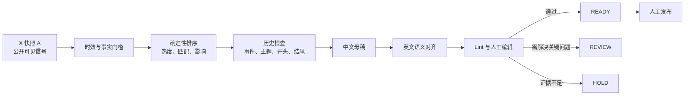

# PredX X News Workflow

[English](README.md) · [架构说明](docs/ARCHITECTURE.md) · [负责任使用](docs/RESPONSIBLE_USE.md) · [发布检查清单](docs/PUBLICATION_CHECKLIST.md)

这是一个“人审在环”的双语 X 推文生产工作流。它把 X 热度信号、来源与时效门槛、账号领域分配、中文母稿、英文语义对齐、历史去重和确定性发布前检查组合为一套可审计流程。

本仓库用于公开展示工作流设计，不是自动发帖机器人。它不会登录 X、保存账号凭据、自动发布内容或执行点赞、回复、转发、关注等互动。

## 项目解决的问题

- **先验证需求，再开始写作：** X 上的可见热度用于选题，但不能替代事实验证。
- **先验证事实，再追求传播：** 通过一手来源或可靠媒体核实事件、数字、阶段和不确定性。
- **双语严格对齐：** 先锁定中文母稿，再逐段生成英文，保持事实顺序、数字、归因、限定条件和结论一致。
- **账号定位清晰：** 四个账号视角服务于同一套受控的 PredX 编辑系统，不伪装成互不相关的独立背书。
- **发布权留给编辑：** 结果分为 `READY`、`REVIEW`、`HOLD`，最终发布始终需要人工确认。

## 流程概览



## 仓库内容

| 目录或文件 | 用途 |
|---|---|
| `.agents/skills/predx-x-news-writer/` | 可安装的 Codex Skill 与完整编辑契约 |
| `references/` | 来源、时效、账号、双语、风格、调度和验证规则 |
| `rank_candidates.py` | 候选新闻评分和账号领域优先级 |
| `build_run_context.py` | 生成近期开稿历史，用于事件与表达去重 |
| `lint_output.py` | 检查结构、双语一致性、安全规则和历史冲突 |
| `examples/` | 不包含真实运行数据的合成示例 |
| `tests/` | 不依赖第三方包的 CLI 冒烟测试 |

生产运行记录、浏览器状态、来源归档、本机依赖和凭据均不会进入公开仓库。

## 快速体验

需要 Python 3.10+，工具脚本仅使用标准库。

```bash
git clone https://github.com/Faiz-V/predx-x-news-workflow.git
cd predx-x-news-workflow

python .agents/skills/predx-x-news-writer/scripts/rank_candidates.py \
  examples/news-packet.json \
  --now 2026-08-11T09:30:00+08:00

python .agents/skills/predx-x-news-writer/scripts/lint_output.py \
  examples/sample-output.json

python -m unittest discover -s tests -v
```

示例只使用 `example.com` 和虚构内容，用来演示输入输出契约，不暴露真实运营历史。

## 安全边界

- 仅使用只读研究界面，不处理登录、Cookie、验证码、代理轮换或反检测。
- 不自动发布、排程、点赞、回复、转发、关注或收藏。
- 不把病毒式传播等同于事实可信度。
- 不生成投资建议、保证性表述、无证据因果、虚构引语或党派动员。
- 即使状态为 `READY`，也必须由编辑做最终复核。

## 明确不包含的部分

这是编辑智能层，不是开箱即用的 SaaS。浏览器采集器、定时服务、凭据存储、自动发布集成、数据看板和生产历史都不在公开范围内。调度文档描述运行契约，但不会自行安装任何 cron 或外部自动化。

## 项目说明

仓库中的四个账号标签是同一 PredX 系统内的内容分发视角，不应被包装成互不相关的第三方用户或独立背书。公开账号简介和相关沟通应清楚披露关联关系。

当前展示仓库未选择开源许可证。公开可见不代表授权复用 PredX 名称、账号身份或专属写作规则。
