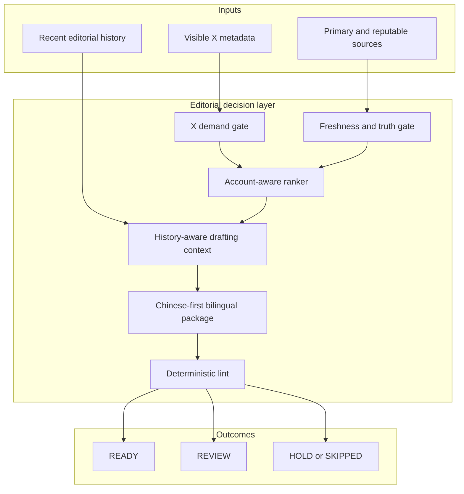

# Architecture

## System boundary

PredX X News Workflow is an editorial decision layer. It accepts normalized news candidates and recent output history, produces a ranked shortlist and a structured bilingual draft package, and stops before publication.



External scheduling, browser control, source storage, and X publication remain outside this boundary. The project-wide lease is acquired before history, metrics, browser, or output work; a competing run stops with `SKIPPED_CONCURRENT_RUN` instead of waiting or bypassing the lease. Optional performance metrics enter only as a soft tie-breaker after the normal editorial gates.

## Core stages

### 0. Shared-run reliability boundary

`run_lock.py` serializes all four account workflows because they share project history and a signed-in research surface. It records acquisition, heartbeat, release, and stale-lease recovery without exposing the token to a competing run. `check_manual_cooldown.py` prevents repeated Alpha retries from turning a temporary evidence gap into a hot loop; an explicit operator override is required to bypass that cooldown.

### 1. X demand gate

Scheduled runs begin with visible X metadata. The workflow separates audience demand from factual confidence: engagement can raise a candidate's selection score, but a viral post still fails if the underlying claim cannot be verified.

The heat model combines recency, engagement velocity, independent echoes, and account fit. It emits `HOT`, `WARM`, or `UNPROVEN`.

### 2. Freshness and truth gate

Candidates are checked against explicit time windows and a source hierarchy. A primary source plus independent reporting is preferred for consequential or disputed claims. Old facts do not become fresh merely because they were reposted.

### 3. Account-aware ranking

`rank_candidates.py` applies a deterministic score:

```text
freshness + verification + impact + 0.45 × X heat + fit adjustments − penalties
```

Account categories constrain eligibility. `PolyPredX` gives qualified geopolitics and international-security stories priority over general domestic-politics fallbacks, without weakening the truth or freshness gates.

### 4. History context

`build_run_context.py` scans recent structured outputs and returns compact context:

- blocked story and topic keys;
- recent openings and endings;
- same-day style fingerprints;
- recent `HOLD` decisions.

This context prevents both factual duplication and template-like repetition.

### 5. Optional performance feedback

`build_performance_feedback.py` reads append-only, public post-metric snapshots and computes same-account medians, relative view indices, and grouped style associations. The resulting context is deliberately conservative: `MONITOR_ONLY` signals stay informational, while `LIMITED_EXPERIMENT` associations can break a close tie only after truth, freshness, account-fit, sensitivity, duplication, and source-quality gates have passed. Missing or stale metrics do not block normal production.

### 6. Bilingual drafting contract

Chinese is the authoritative mother draft. English is written only after the Chinese copy is locked, then aligned block by block. Numbers, named entities, attribution, causal strength, uncertainty, and the ending must remain equivalent.

### 7. Deterministic lint

`lint_output.py` checks:

- supported account, status, and post mode;
- source URLs and source time;
- `READY` / `REVIEW` / `HOLD` body rules;
- Chinese and English block parity;
- numeric alignment warnings;
- length, block count, sentence density, URL, hashtag, and CTA rules;
- scheduled X-signal requirements;
- repeated story, topic, opening, or ending patterns.

The linter does not decide factual truth. It verifies that the structured package obeys the declared editorial contract.

## Data contracts

### Candidate packet

The packet contains an `items` array. Each candidate can carry source details, timestamps, categories, account hints, verification status, impact score, and an `x_signal` snapshot. See `references/news-input-schema.md` and `examples/news-packet.json`.

### Draft package

A usable item includes its account, status, story keys, style fingerprint, source metadata, Chinese copy, English copy, and editorial checks. `HOLD` items deliberately omit both post bodies.

## Trust model

| Layer | Deterministic | Requires human judgment |
|---|---:|---:|
| Timestamp parsing and freshness bands | Yes | Edge-case interpretation |
| Candidate scoring and account routing | Yes | Impact and source-quality inputs |
| Structural and bilingual lint | Yes | Semantic nuance and factual accuracy |
| Release status recommendation | Partly | Final decision |
| X publication | No | Always |

## Failure behavior

The workflow fails closed. Missing X visibility becomes `SKIPPED_X_SESSION_UNAVAILABLE`; incomplete research remains `HOLD`; a material unresolved issue becomes `REVIEW`. It does not invent evidence or lower the gates to fill a quota.
